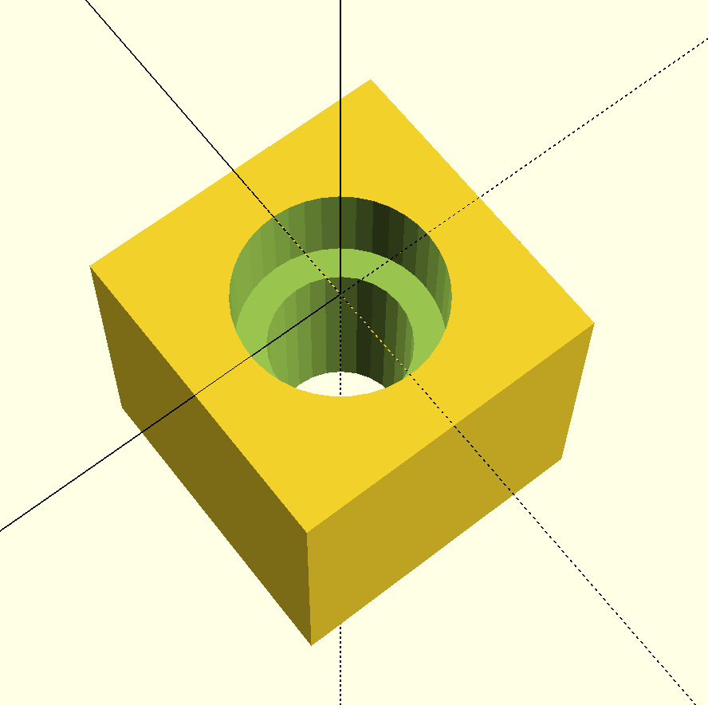
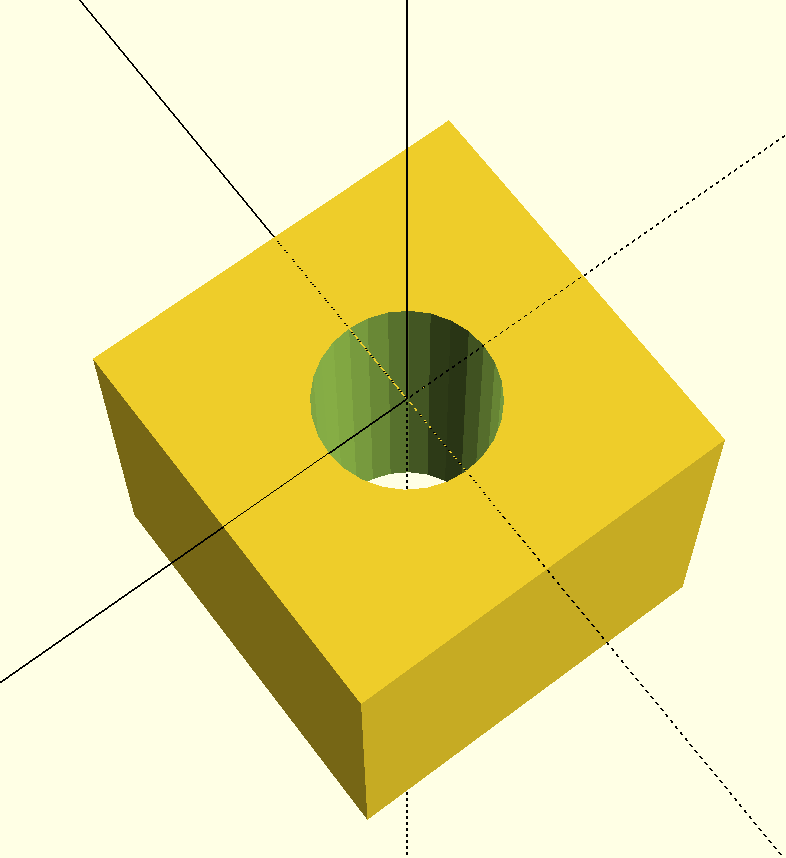
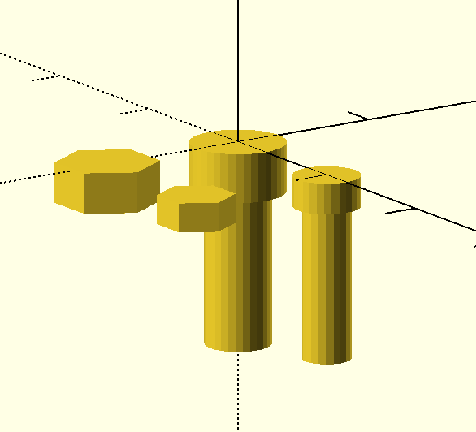
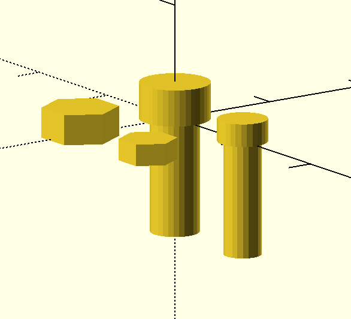

# Nut and Bolt Cutouts

This library provides printable profiles of nuts and bolts. Currently,
it includes M2 and M3 profiles.

The tolerance and part constants are based on empirical measurements
from a digital caliper, using machine head metric nuts/screws/bolts, and
from prints on my QIDI printer with various ABS filaments.

A calibration object for tuning this to your hardware is included under
`test/MetricCalibrationPlate.scad`.

In my case, I have found that a tolerance (extra space around edges of profiles)
of 0.1 millimeters results in tight fitting parts that aren't difficult to
insert, and 0.2 millimeters results in a loose fitting part.

## Usage

The intended usage is to use this library for `difference` cutouts:

```scad
use <Metric/M3.scad>;

$fs = 0.5;
$fa = 2;

w = 10;
h = 10;

difference() {
  translate([-w/2, -w/2, -h])
  cube([w, w, h]);

  BoltM3(l=15);
}
```



# Inset

By default, all parts have their origin extending in the negative Z direction,
with the head of the part at [0, 0, 0]. You can place the head above the X-Y
plane by specifying the optional parameter `inset=1`

```scad
use <Metric/M3.scad>;

$fs = 0.5;
$fa = 2;

w = 10;
h = 10;

difference() {
  translate([-w/2, -w/2, -h])
  cube([w, w, h]);

  BoltM3(l=15, inset=0);
}
```



# Parts

```scad
use <Metric/M3.scad>;
use <Metric/M2.scad>;

$fs = 0.5;
$fa = 2;

BoltM3();

translate([0, -10, 0])
NutM3();

translate([10, 0, 0])
BoltM2();

translate([10, -10, 0])
NutM2();
```

## Inset


## No Inset


# Acknowledgements

I'm using the Hexagon module from [Regular Convex Polygon Library - OpenSCAD by VincentD](http://www.thingiverse.com/thing:335968)

# Author

[Brian Jorgensen](https://github.com/b33j0r/), 2016

# License

Distributed under [Creative Commons Share-alike](https://creativecommons.org/licenses/by-sa/3.0/us/):

You are free to:

* Share — copy and redistribute the material in any medium or format
* Adapt — remix, transform, and build upon the material for any purpose, even commercially.

The licensor cannot revoke these freedoms as long as you follow the license terms:

* Attribution — You must give appropriate credit, provide a link to the license, and indicate if changes were made. You may do so in any reasonable manner, but not in any way that suggests the licensor endorses you or your use.
* ShareAlike — If you remix, transform, or build upon the material, you must distribute your contributions under the same license as the original.

No additional restrictions — You may not apply legal terms or technological measures that legally restrict others from doing anything the license permits.

PS: I'm not going to sue you for using this in any way you want, I'm basically just respecting the licensing terms of `Polygon.scad`, upon which this relies :smile:
